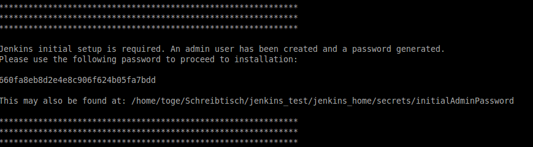
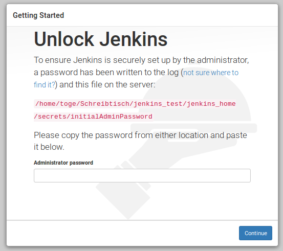
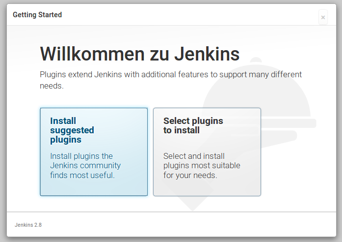
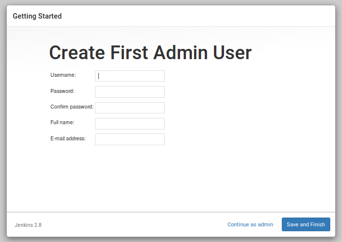
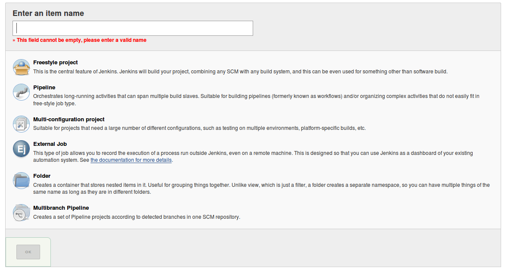
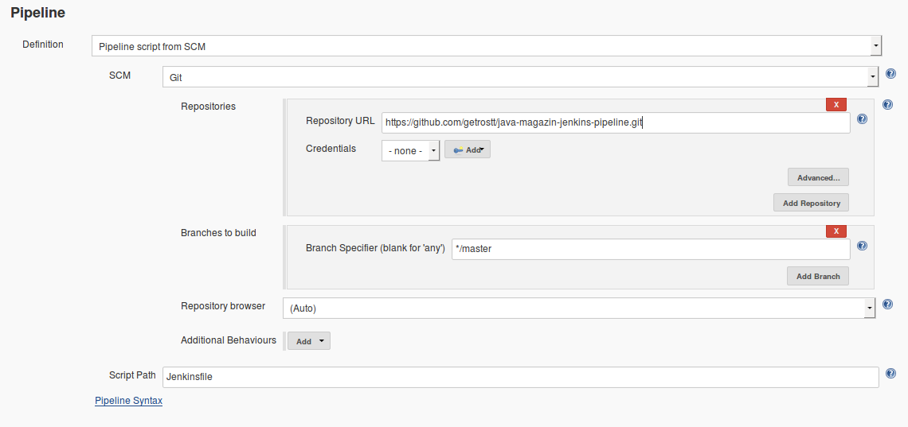

# Java Magazin 09/2016: Jenkins Pipeline
Example Code for my article about Jenkins Pipeline in the German Java Magazin

## Local setup (linux)
1. Setup local WildFly
 1. [Download WildFly 10](http://wildfly.org/downloads/)
 2. Unzip WildFly
 3. Run WildFly with `bin/standalone.sh -Djboss.socket.binding.port-offset=200`
 4. Add a management user using `bin/add-user.sh`
2. Setup Jenkins
 1. [Download Jenkins 2.x war](https://jenkins.io)
 2. Run Jenkins with `java -jar jenkins.war --httpPort=8180`
 3. Unlock jenkins using the password provided on the shell when starting jenkins
    

    
 4. Install suggested plugins
    
 5. Configure admin user
    
 6. Install the following additional plugins (Manage Jenkins -> Manage Plugins -> Tab Available):  
 Pipeline Utility Steps
 7. Restart Jenkins

## Configure Jenkins
1. Configure Tools (Manage Jenkins -> Global Tool Confiugration)
 1. Add JDK  
    Name: JDK_1.8  
    Install automatically: yes  
    Select newest JDK 1.8 version
 2. Add Maven  
    Name: maven_3.3.3  
    Install automatically: yes  
    Select version: 3.3.3
2. Configure mail (Manage Jenkins -> Configure System -> E-mail Notification)
3. Setup credentials for WildFly (Credentials -> Sytem -> Global credentials -> Add Credentials)  
   Kind: Username with password  
   Scope: Global  
   Username: User name of your WildFly  
   Password: Password of yout WildFly  
   ID: wildFlyManagementCredentials

## Create Jenkins Job
1. Create a new pipeline Job and use the `Jenkinsfile` provided in this repo
 1. Select 'New item'
 2. Enter job name and select pipeline project
   
 3. In the pipeline section of the configuration page configure the following:  
    Definition: Pipeline script from SCM  
    SCM: Git  
    Repositories: https://github.com/getrostt/java-magazin-jenkins-pipeline.git
    
